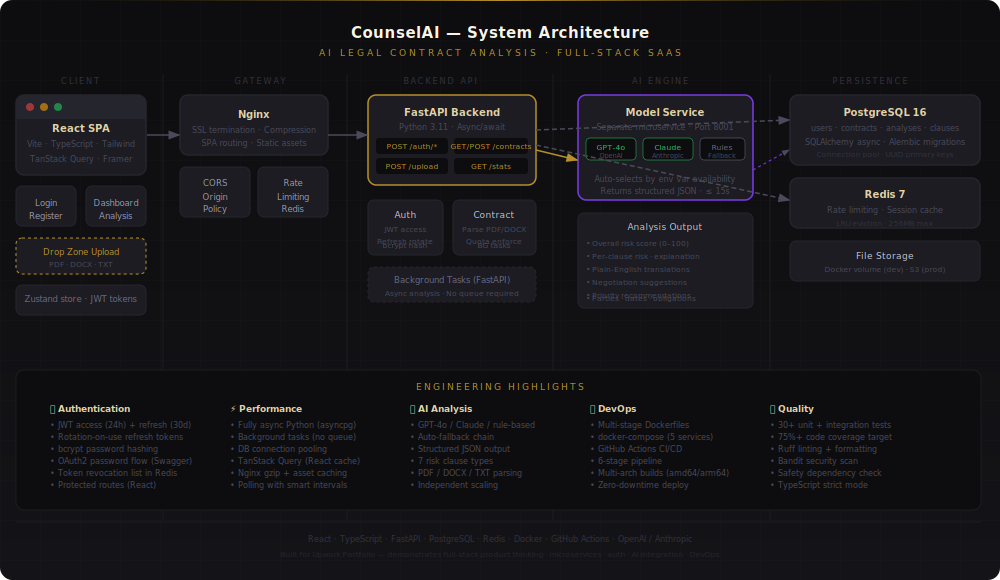

# ⚖️ CounselAI — AI Legal Contract Analysis Platform

> **Full-stack AI SaaS product** — upload any contract and get a complete risk analysis, plain-English clause explanations, and negotiation recommendations in under 60 seconds.



---

## 🎯 The Business Problem

Legal review is expensive ($300–$500/hr), slow, and inaccessible to most founders, freelancers, and small teams. One missed clause in an IP assignment or a non-compete can cost tens of thousands of dollars.

**CounselAI** makes expert-level contract review available to everyone, instantly.

| Without CounselAI | With CounselAI |
|---|---|
| $1,500+ lawyer review per contract | $49/month for unlimited team use |
| 2–3 business days turnaround | 30–60 second analysis |
| Dense legal jargon | Plain-English explanations |
| Easy to miss subtle risks | Every clause scored and flagged |

---

## 🏗️ Architecture

```
Browser (React SPA)
  └── Nginx (SSL, gzip, SPA routing)
        └── FastAPI Backend (auth, contracts, REST API)
              ├── PostgreSQL (users, contracts, analyses, clauses)
              ├── Redis (rate limiting, token cache)
              └── Model Service (microservice, port 8001)
                    ├── GPT-4o    (if OPENAI_API_KEY set)
                    ├── Claude    (if ANTHROPIC_API_KEY set)
                    └── Rules     (rule-based fallback, always works)
```

---

## ✨ Features

### Product
- **Contract upload** — PDF, DOCX, TXT, up to 50MB
- **Risk scoring** — 0–100 score with critical/high/medium/low classification
- **Clause analysis** — 10 clause types (IP, non-compete, liability, termination, NDA, payment…)
- **Plain-English explanations** — every clause translated for non-lawyers
- **Negotiation tips** — specific language suggestions for risky clauses
- **AI summary** — executive overview + key obligations
- **Dashboard** — all contracts, usage tracking, aggregate stats

### Engineering
- **JWT auth** — access + refresh tokens with rotation, bcrypt hashing
- **Async backend** — FastAPI + asyncpg, fully non-blocking
- **Microservices** — model service scales independently of API
- **Multi-LLM** — GPT-4o → Claude → rule-based fallback chain
- **Background tasks** — analysis runs after HTTP response (no blocking)
- **SaaS billing model** — Free/Pro/Enterprise plan enforcement
- **CI/CD** — 6-stage GitHub Actions (test → lint → build → scan → deploy)
- **Docker** — multi-stage builds, health checks, non-root users

---

## 🚀 Quick Start

### Prerequisites
- Docker & Docker Compose
- (Optional) OpenAI or Anthropic API key for LLM analysis

### 1. Clone & configure
```bash
git clone https://github.com/junaid-dev-ai/Counsel-AI.git
cd Counsel-AI
cp .env.example .env
# Edit .env — set SECRET_KEY, POSTGRES_PASSWORD, and optionally OPENAI_API_KEY
```

### 2. Start all services
```bash
docker compose up -d
# PostgreSQL, Redis, model service, backend, and frontend all start automatically
```

### 3. Run database migrations
```bash
docker compose exec backend alembic upgrade head
```

### 4. Open the app
```
Frontend:  http://localhost:3000
API docs:  http://localhost:8000/api/docs
Model API: http://localhost:8001/docs
```

### Local development (no Docker)
```bash
# Backend
cd Counsel-AI
pip install -r backend/requirements.txt
uvicorn backend.main:app --reload --port 8000

# Model service
uvicorn model_service.app.main:app --reload --port 8001

# Frontend
cd frontend
npm install
npm run dev   # → http://localhost:3000
```

---

## 🧪 Tests

```bash
# Backend + model service tests
pytest backend/app/tests/ model_service/ -v --cov=backend --cov=model_service --cov-fail-under=70

# Frontend TypeScript check
cd frontend && npx tsc --noEmit

# Frontend lint
cd frontend && npm run lint
```

**Test coverage includes:**
- Password hashing & JWT roundtrip
- Refresh token rotation
- Schema validation (Pydantic)
- Text extraction (PDF/DOCX/TXT)
- Rule-based analysis engine (15+ scenarios)
- Model service fallback behavior
- Quota enforcement logic

---

## 📁 Project Structure

```
counselai/
├── backend/
│   ├── app/
│   │   ├── api/v1/endpoints/
│   │   │   ├── auth.py           # POST /auth/register, /login, /refresh, /logout
│   │   │   └── contracts.py      # Upload, list, get, delete, stats
│   │   ├── core/config.py        # Settings via env vars (pydantic-settings)
│   │   ├── models/database.py    # SQLAlchemy ORM models + async session
│   │   ├── schemas/schemas.py    # Pydantic request/response schemas
│   │   ├── services/
│   │   │   ├── auth.py           # JWT, bcrypt, token management
│   │   │   └── contract.py       # Upload, parse, quota, analysis orchestration
│   │   └── tests/test_main.py    # 30+ unit + integration tests
│   ├── requirements.txt
│   └── main.py                   # FastAPI app, middleware, routers
│
├── model_service/
│   └── app/
│       ├── main.py               # FastAPI microservice, LLM routing
│       └── rules.py              # Rule-based analysis engine (fallback)
│
├── frontend/
│   └── src/
│       ├── components/
│       │   ├── AppShell.tsx      # Sidebar layout, nav, user info
│       │   ├── UploadModal.tsx   # Drag-drop with progress
│       │   └── RiskComponents.tsx# Risk badges, meter, pills
│       ├── pages/
│       │   ├── LandingPage.tsx   # Marketing site with pricing
│       │   ├── LoginPage.tsx     # Auth forms (shared layout)
│       │   ├── DashboardPage.tsx # Contract list + stats
│       │   └── ContractPage.tsx  # Full analysis view
│       ├── lib/
│       │   ├── api.ts            # Axios + JWT refresh interceptors
│       │   └── store.ts          # Zustand global state
│       └── types/index.ts        # All TypeScript types
│
├── infrastructure/
│   ├── nginx/nginx.conf          # SPA routing, gzip, security headers
│   └── postgres/init.sql         # DB extensions initialization
│
├── docs/architecture.svg         # System architecture diagram
├── Dockerfile.backend            # Multi-stage Python build
├── Dockerfile.model              # Model service container
├── Dockerfile.frontend           # Node build → Nginx runtime
├── docker-compose.yml            # Full 5-service stack
├── .github/workflows/ci.yml      # 6-stage CI/CD pipeline
└── .env.example                  # Environment variable template
```

---

## 🔧 Environment Variables

| Variable | Required | Description |
|---|---|---|
| `SECRET_KEY` | ✅ | 32+ char random string for JWT signing |
| `POSTGRES_PASSWORD` | ✅ | Database password |
| `REDIS_PASSWORD` | ✅ | Redis password |
| `OPENAI_API_KEY` | Optional | Enables GPT-4o analysis |
| `ANTHROPIC_API_KEY` | Optional | Enables Claude analysis |
| `VITE_API_URL` | Optional | Frontend API base URL (default: localhost:8000) |

Without LLM keys, the rule-based analysis engine runs automatically — perfect for development and demos.

---

## 🔌 API Reference

```bash
# Register
POST /api/v1/auth/register
{ "email": "...", "full_name": "...", "password": "..." }

# Login
POST /api/v1/auth/login
{ "email": "...", "password": "..." }

# Upload contract (multipart)
POST /api/v1/contracts/upload
Authorization: Bearer <token>
Content-Type: multipart/form-data

# Get analysis
GET /api/v1/contracts/{id}
Authorization: Bearer <token>

# Dashboard stats
GET /api/v1/contracts/stats
Authorization: Bearer <token>
```

Full interactive docs at `/api/docs` (Swagger UI) or `/api/redoc`.

---

## 🏆 Senior Engineering Patterns Demonstrated

| Pattern | Implementation |
|---|---|
| **Microservices** | Model service runs independently, scales separately |
| **Async Python** | asyncpg, SQLAlchemy async, FastAPI background tasks |
| **Token rotation** | Refresh tokens hashed (SHA-256), rotated on every use |
| **SaaS quota system** | Per-plan limits with monthly resets, 429 enforcement |
| **Graceful degradation** | LLM unavailable → rule-based analysis, never crashes |
| **React Query** | Stale-while-revalidate, smart polling for async analysis |
| **Multi-stage Docker** | Builder → runtime, non-root user, health checks |
| **Zero-downtime deploy** | Rolling restart order in CI/CD SSH deploy step |
| **Security scanning** | Bandit (SAST) + Safety (dependency CVEs) in CI |

---

## 📄 License

MIT

---

*⚠️ CounselAI is not a law firm and does not provide legal advice. Always consult a qualified attorney before signing contracts.*
